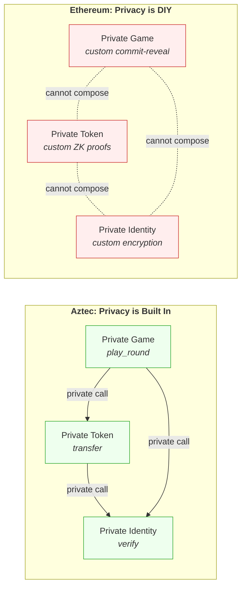

# Onboarding: From Ethereum to Aztec

This guide takes you from "reading code in a browser" to "deploying contracts" — progressively, with no install required until Phase 3.

**What you'll learn:** How Aztec contracts work by studying a Pod Racing game — a two-player competitive game that uses private state to implement commit-reveal in a single transaction.

**How the guide is structured:**

* **Phases 1-2** need only a browser (read code, compile in a Codespace)
* **Phases 3-6** need local tools (deploy, interact, extend, advanced topics)

**Aztec version pinned in this repo:** `5.0.0-rc.1` (check `Nargo.toml` and `package.json` for source of truth)

**Links:**

* [Aztec Docs](https://docs.aztec.network)
* [Noir Language](https://noir-lang.org)
* [Discord](https://discord.gg/aztec)

***

## Phase 1: Read and Understand (No Install Required)

**Goal:** Build a mental model of Aztec by reading the contract code in your browser.

### 1.1 — Aztec vs Ethereum: Quick Mental Model

Aztec is an L2 on Ethereum with **native privacy**. Three core ideas separate it from a typical EVM rollup:

1. **Two kinds of state.** Public state works like Ethereum storage — everyone can read it. Private state is encrypted; only the owner can read it.
2. **Noir** is the smart contract language. It looks like Rust and compiles to zero-knowledge circuits.
3. **PXE** (Private eXecution Environment) is a local client that manages your private state and builds proofs before sending transactions. There is no Ethereum equivalent.

#### Ethereum-to-Aztec comparison table

| Concept                          | Ethereum                   | Aztec                                   |
| -------------------------------- | -------------------------- | --------------------------------------- |
| **Language**                     | Solidity                   | Noir                                    |
| **Public state mapping**         | `mapping(address => uint)` | `Map<AztecAddress, PublicMutable<u64>>` |
| **Private state model**          | No equivalent              | Notes, private encrypted state          |
| **Caller context**               | `msg.sender`               | `context.msg_sender()`                  |
| **Public function declaration**  | `public function`          | `#[external("public")]`                 |
| **Private function declaration** | No native equivalent       | `#[external("private")]`                |
| **Commit-reveal pattern**        | Manual commit-reveal       | Built into the protocol                 |
| **Account model**                | EOA accounts               | Account abstraction                     |
| **Gas payment model**            | ETH for gas                | Fee Payment Contracts, sponsored fees   |

**Key concepts in more detail:**

* **Notes** — Private state primitives. Think of them as encrypted UTXOs that only the owner can decrypt and read. When you "write" private state, you create a note. When you "read" it, your PXE decrypts it locally. ([Aztec docs: Notes](https://docs.aztec.network/developers/docs/foundational-topics/state_management#notes))
* **Public vs Private functions** — Public functions execute on the network (like Solidity). Private functions execute locally in your PXE and produce a proof that gets verified on-chain. ([Aztec docs: Functions](https://docs.aztec.network/developers/docs/aztec-nr/framework-description/functions))
* **PXE** — Your local execution environment. It stores your private notes, builds proofs, and submits transactions. Each user runs their own PXE. ([Aztec docs: PXE](https://docs.aztec.network/aztec/concepts/pxe))
* **Account abstraction** — Every Aztec account is a smart contract. There are no EOAs. This repo uses Schnorr signature accounts. ([Aztec docs: Accounts](https://docs.aztec.network/aztec/concepts/accounts))

### 1.2 — The Pod Racing Game: What It Does

Think of managing a pod racing team: you have limited resources (crew, fuel, parts) and 5 race tracks to compete on over 3 rounds. Each round you secretly decide how to spread your resources across the tracks — go all-in on a few, or spread thin across all five? After all rounds, your totals are revealed and whoever dominated more tracks wins the series. The game isn't about speed — it's about strategy under hidden information, which is exactly what Aztec's private state enables.

The Pod Racing contract ([`src/main.nr`](./src/main.nr)) is a two-player competitive game where players allocate points across 5 tracks over 3 rounds. It naturally requires commit-reveal (players shouldn't see each other's moves), making it a perfect Aztec demo.

**Game flow:**

1. Player 1 **creates** a game with a unique ID
2. Player 2 **joins** the game
3. Both players **play 3 rounds privately** — each round they distribute up to 9 points across 5 tracks
4. Both players **finish/reveal** — their private round notes are summed and the totals published
5. Anyone **finalizes** — the winner is determined by who won more tracks (best of 5)

**Rules:**

* 2 players per game
* 5 tracks, 3 rounds
* Each round: distribute up to 9 points across the 5 tracks
* After all rounds, each track's total is compared between players
* The player who wins 3+ tracks wins the game

> Reference: top comment block in `src/main.nr`

### 1.3 — Contract Walkthrough: Storage

Open `src/main.nr` and look at the `Storage` struct:

```rust title="storage" showLineNumbers
#[storage]
struct Storage<Context> {
    // Contract administrator address
    admin: PublicMutable<AztecAddress, Context>,

    // Maps game_id -> Race struct containing public game state
    // Stores player addresses, round progress, and final track scores
    races: Map<Field, PublicMutable<Race, Context>, Context>,

    // Maps game_id -> player_address -> private notes containing that player's round choices
    // Each GameRoundNote stores the point allocation for one round
    // This data remains private until the player calls finish_game
    progress: Map<Field, Owned<PrivateSet<GameRoundNote, Context>, Context>, Context>,

    // Maps player address -> total number of wins
    // Public leaderboard tracking career victories
    win_history: Map<AztecAddress, PublicMutable<u64, Context>, Context>,
}
```

<sup><sub><a href="https://github.com/AztecProtocol/aztec-starter/blob/main/src/main.nr#L40-L59" target="_blank" rel="noopener noreferrer">Source code: /src/main.nr#Lstorage</a></sub></sup>

**What is `Context`?** You'll notice `Context` appears as a generic parameter throughout the storage definition. In Aztec, the context is the execution environment passed to every function — it's how your contract accesses blockchain state like `context.msg_sender()` (the caller's address) and `context.block_number()`. Think of it as an expanded version of Solidity's global variables (`msg.sender`, `block.number`, etc.), but packaged as an object. The `<Context>` generic on storage types lets the same storage struct work in both public and private execution contexts. You don't need to construct it yourself — the framework provides `self.context` automatically in every contract function.

What each field does:

| Field         | Type                                           | Visibility  | Purpose                                                                                   |
| ------------- | ---------------------------------------------- | ----------- | ----------------------------------------------------------------------------------------- |
| `admin`       | `PublicMutable<AztecAddress>`                  | Public      | Contract administrator address, set in constructor                                        |
| `races`       | `Map<Field, PublicMutable<Race>>`              | Public      | Maps `game_id` to a `Race` struct with player addresses, round progress, and final scores |
| `progress`    | `Map<Field, Owned<PrivateSet<GameRoundNote>>>` | **Private** | Maps `game_id` → `player` → set of private notes containing that player's round choices   |
| `win_history` | `Map<AztecAddress, PublicMutable<u64>>`        | Public      | Career win count per player (leaderboard)                                                 |

**Conceptual Solidity equivalent:**

```solidity
// Solidity (approximate)
contract PodRacing {
    address public admin;
    mapping(uint256 => Race) public races;
    // No Solidity equivalent for private state!
    // Aztec's `progress` stores encrypted data only the owner can read
    mapping(address => uint256) public winHistory;
}
```

**State variable types — one sentence each:**

* [`PublicMutable`](https://docs.aztec.network/developers/docs/aztec-nr/framework-description/state_variables#publicmutable) — A single public value that can be read and written by public functions. Like a Solidity state variable.
* [`Map`](https://docs.aztec.network/developers/docs/aztec-nr/framework-description/state_variables#map) — A key-value mapping, like Solidity's `mapping`.
* [`PrivateSet`](https://docs.aztec.network/developers/docs/aztec-nr/framework-description/state_variables#privateset) — A set of private notes. Notes can be inserted, read (by owner), and nullified.
* [`Owned`](https://docs.aztec.network/developers/docs/aztec-nr/framework-description/state_variables#owned) — A wrapper that scopes private state to a specific owner, so `progress.at(game_id).at(player)` returns only that player's notes.

### 1.4 — Contract Walkthrough: Public Functions

These functions should feel familiar if you've written Solidity.

#### `constructor()`

```rust title="constructor" showLineNumbers
#[external("public")]
#[initializer]
fn constructor(admin: AztecAddress) {
    debug_log_format("Initializing PodRacing contract with admin {0}", [admin.to_field()]);
    self.storage.admin.write(admin);
}
```

<sup><sub><a href="https://github.com/AztecProtocol/aztec-starter/blob/main/src/main.nr#L61-L68" target="_blank" rel="noopener noreferrer">Source code: /src/main.nr#Lconstructor</a></sub></sup>

Sets the admin address. The `#[initializer]` macro means this runs once at deployment, like a Solidity constructor.

#### `create_game()`

```rust title="create-game" showLineNumbers
// Creates a new game instance
// The caller becomes player1 and waits for an opponent to join
// Sets the game expiration to current block + GAME_LENGTH
#[external("public")]
fn create_game(game_id: Field) {
    // Ensure this game_id hasn't been used yet (player1 must be zero address)
    assert(self.storage.races.at(game_id).read().player1.eq(AztecAddress::zero()));

    let player1 = self.msg_sender();
    debug_log_format(
        "Creating game {0} by player {1}",
        [game_id, player1.to_field()],
    );

    // Initialize a new Race with the caller as player1
    let game = Race::new(
        player1,
        TOTAL_ROUNDS,
        self.context.block_number() + GAME_LENGTH,
    );
    self.storage.races.at(game_id).write(game);
}
```

<sup><sub><a href="https://github.com/AztecProtocol/aztec-starter/blob/main/src/main.nr#L70-L93" target="_blank" rel="noopener noreferrer">Source code: /src/main.nr#Lcreate-game</a></sub></sup>

Creates a new game. Checks the game ID isn't taken (player1 must be zero address), then writes a new `Race` struct with the caller as player1 and an expiration time.

#### `join_game()`

```rust title="join-game" showLineNumbers
// Allows a second player to join an existing game
// After joining, both players can start playing rounds
#[external("public")]
fn join_game(game_id: Field) {
    let maybe_existing_game = self.storage.races.at(game_id).read();

    let player2 = self.msg_sender();
    debug_log_format("Player {0} joining game {1}", [player2.to_field(), game_id]);

    // Add the caller as player2 (validates that player1 exists and player2 is empty)
    let joined_game = maybe_existing_game.join(player2);
    self.storage.races.at(game_id).write(joined_game);
}
```

<sup><sub><a href="https://github.com/AztecProtocol/aztec-starter/blob/main/src/main.nr#L95-L109" target="_blank" rel="noopener noreferrer">Source code: /src/main.nr#Ljoin-game</a></sub></sup>

A second player joins. The `Race::join()` method validates that player1 exists, the player2 slot is empty, and the joiner isn't player1.

#### `finalize_game()`

```rust title="finalize-game" showLineNumbers
// Determines the winner after both players have revealed their scores
// Can only be called after the game's end_block (time limit expired)
// Compares track totals and declares the player who won more tracks as winner
// Winner determination:
// - Compare each of the 5 tracks
// - Player with higher total on a track wins that track
// - Player who wins 3+ tracks wins the game (best of 5)
// - Updates the winner's career win count
#[external("public")]
fn finalize_game(game_id: Field) {
    debug_log_format("Finalizing game {0}", [game_id]);
    let game_in_progress = self.storage.races.at(game_id).read();

    // Calculate winner by comparing track scores (validates game has ended)
    let winner = game_in_progress.calculate_winner(self.context.block_number());
    debug_log_format("Winner determined: {0}", [winner.to_field()]);

    // Update the winner's total win count in the public leaderboard
    let previous_wins = self.storage.win_history.at(winner).read();
    debug_log_format(
        "Updating win count from {0} to {1}",
        [previous_wins as Field, (previous_wins + 1) as Field],
    );
    self.storage.win_history.at(winner).write(previous_wins + 1);
}
```

<sup><sub><a href="https://github.com/AztecProtocol/aztec-starter/blob/main/src/main.nr#L265-L292" target="_blank" rel="noopener noreferrer">Source code: /src/main.nr#Lfinalize-game</a></sub></sup>

After both players have revealed, this compares track scores, determines the winner, and updates the leaderboard.

#### The `Race` struct ([`src/race.nr`](./src/race.nr))

The `Race` struct stores all public game state. It has 17 fields:

```rust title="race-struct" showLineNumbers
// Race struct stores the public state of a game
// This data is visible to everyone and tracks game progress
#[derive(Deserialize, Serialize, Eq, Packable)]
pub struct Race {
    // Player addresses
    pub player1: AztecAddress,
    pub player2: AztecAddress,

    // Game configuration
    pub total_rounds: u8,  // Always 3 for this game

    // Round progress tracking (which round each player is on)
    pub player1_round: u8,
    pub player2_round: u8,

    // Player 1's final revealed track totals (sum of all rounds)
    // Nested structs not working on this version
    pub player1_track1_final: u64,
    pub player1_track2_final: u64,
    pub player1_track3_final: u64,
    pub player1_track4_final: u64,
    pub player1_track5_final: u64,

    // Player 2's final revealed track totals (sum of all rounds)
    pub player2_track1_final: u64,
    pub player2_track2_final: u64,
    pub player2_track3_final: u64,
    pub player2_track4_final: u64,
    pub player2_track5_final: u64,

    // Block number when the game expires (for timeout enforcement)
    pub end_block: u32,
}
```

<sup><sub><a href="https://github.com/AztecProtocol/aztec-starter/blob/main/race.nr#L7-L41" target="_blank" rel="noopener noreferrer">Source code: /src/race.nr#Lrace-struct</a></sub></sup>

Key methods:

* **`Race::new()`** — Creates a game with player1, zero'd scores, and an expiration block
* **`Race::join()`** — Adds player2 after validating the game is joinable and the player isn't playing themselves
* **`Race::calculate_winner()`** — Compares each track's totals, counts wins per player, returns the address of whoever won 3+ tracks (ties go to player2)

### 1.5 — Contract Walkthrough: Private Functions (The Key Difference)

This is the "aha moment" — the part with no Ethereum equivalent.

#### `play_round()`

```rust title="play-round" showLineNumbers
// Plays a single round by allocating points across 5 tracks
// This is a PRIVATE function - the point allocation remains hidden from the opponent
// Players must play rounds sequentially (round 1, then 2, then 3)
// Parameters:
// - track1-5: Points allocated to each track (must sum to less than 10)
// - round: Which round this is (1, 2, or 3)
#[external("private")]
fn play_round(
    game_id: Field,
    round: u8,
    track1: u8,
    track2: u8,
    track3: u8,
    track4: u8,
    track5: u8,
) {
    // Validate that total points don't exceed 9 (you can't max out all tracks)
    assert(track1 + track2 + track3 + track4 + track5 < 10);

    let player = self.msg_sender();
    debug_log_format(
        "Player {0} playing round {1} in game {2}",
        [player.to_field(), round as Field, game_id],
    );
    debug_log_format(
        "Track allocations: {0}, {1}, {2}, {3}, {4}",
        [track1 as Field, track2 as Field, track3 as Field, track4 as Field, track5 as Field],
    );

    // Store the round choices privately as a note in the player's own storage
    // This creates a private commitment that can only be read by the player
    self
        .storage
        .progress
        .at(game_id)
        .at(player)
        .insert(GameRoundNote::new(track1, track2, track3, track4, track5, round, player))
        .deliver(MessageDelivery.ONCHAIN_CONSTRAINED);

    // Enqueue a public function call to update the round counter
    // This reveals that a round was played, but not the point allocation
    self.enqueue_self.validate_and_play_round(player, game_id, round);
}
```

<sup><sub><a href="https://github.com/AztecProtocol/aztec-starter/blob/main/src/main.nr#L111-L156" target="_blank" rel="noopener noreferrer">Source code: /src/main.nr#Lplay-round</a></sub></sup>

Three things happen here that have no direct Ethereum equivalent:

1. **Point constraint** — `track1 + track2 + ... < 10` is enforced in the ZK circuit. The prover can't cheat.
2. **Creating a private note** — `.insert(GameRoundNote::new(...))` stores the round choices as an encrypted note. Only the player can read it later. The `.deliver(MessageDelivery.CONSTRAINED_ONCHAIN)` commits the note's hash on-chain without revealing the content.
3. **Enqueuing a public call** — `self.enqueue(...)` schedules a public function to run after the private proof is verified. This updates the round counter publicly (so both players can see progress) without revealing the point allocation.

#### `finish_game()`

```rust title="finish-game" showLineNumbers
// Called after all rounds are complete to reveal a player's total scores
// This is PRIVATE - only the caller can read their own GameRoundNotes
// The function sums up all round allocations per track and publishes totals
// This is the "reveal" phase where private choices become public
#[external("private")]
fn finish_game(game_id: Field) {
    let player = self.msg_sender();
    debug_log_format(
        "Player {0} finishing game {1}",
        [player.to_field(), game_id],
    );

    // Retrieve all private notes for this player in this game
    let totals =
        self.storage.progress.at(game_id).at(player).get_notes(NoteGetterOptions::new());

    // Sum up points allocated to each track across all rounds
    let mut total_track1: u64 = 0;
    let mut total_track2: u64 = 0;
    let mut total_track3: u64 = 0;
    let mut total_track4: u64 = 0;
    let mut total_track5: u64 = 0;

    // Iterate through exactly TOTAL_ROUNDS notes (only this player's notes)
    for i in 0..TOTAL_ROUNDS {
        total_track1 += totals.get(i as u32).note.track1 as u64;
        total_track2 += totals.get(i as u32).note.track2 as u64;
        total_track3 += totals.get(i as u32).note.track3 as u64;
        total_track4 += totals.get(i as u32).note.track4 as u64;
        total_track5 += totals.get(i as u32).note.track5 as u64;
    }

    debug_log_format(
        "Computed totals - tracks: {0}, {1}, {2}, {3}, {4}",
        [total_track1 as Field, total_track2 as Field, total_track3 as Field, total_track4 as Field, total_track5 as Field],
    );

    // Enqueue public function to store the revealed totals on-chain
    // Now the revealing player's track totals will be publicly visible
    self.enqueue_self.validate_finish_game_and_reveal(
        player,
        game_id,
        total_track1,
        total_track2,
        total_track3,
        total_track4,
        total_track5,
    );
}
```

<sup><sub><a href="https://github.com/AztecProtocol/aztec-starter/blob/main/src/main.nr#L175-L226" target="_blank" rel="noopener noreferrer">Source code: /src/main.nr#Lfinish-game</a></sub></sup>

This is the "reveal" phase:

* **Reading own private notes** — `get_notes(NoteGetterOptions::new())` retrieves the player's encrypted round notes. Only the owner's PXE can decrypt these.
* **Summing and publishing** — The totals are calculated privately, then the enqueued public call writes them on-chain for everyone to see.

#### `GameRoundNote` (`src/game_round_note.nr`)

```rust title="game-round-note" showLineNumbers
// GameRoundNote is a private note that stores a player's point allocation for one round
// These notes remain private until the player calls finish_game to reveal their totals
// Privacy model:
// - Each player creates 3 of these notes (one per round) when playing
// - Only the owner can read their own notes
// - During finish_game, the player sums all their notes and reveals the totals publicly
// - This implements a commit-reveal scheme for fair play
#[derive(Eq, Packable)]
#[note]
pub struct GameRoundNote {
    // Points allocated to each of the 5 tracks in this round
    // Must sum to less than 10 points per round
    pub track1: u8,
    pub track2: u8,
    pub track3: u8,
    pub track4: u8,
    pub track5: u8,

    // Which round this note represents (1, 2, or 3)
    pub round: u8,

    // The player who created this note (only they can read it)
    pub owner: AztecAddress,
}
```

<sup><sub><a href="https://github.com/AztecProtocol/aztec-starter/blob/main/game_round_note.nr#L3-L29" target="_blank" rel="noopener noreferrer">Source code: /src/game_round_note.nr#Lgame-round-note</a></sub></sup>

The `#[note]` macro makes this a private state primitive. Each note stores one round's point allocation and the owner's address. Only the owner can read it.

#### Internal functions: `#[only_self]`

Two functions are marked `#[only_self]`, meaning they can only be called by the contract itself (via `self.enqueue(...)`):

* **`validate_and_play_round`** — Validates the round is sequential and increments the player's round counter
* **`validate_finish_game_and_reveal`** — Stores the player's revealed track totals, checking they haven't already been revealed

**Key insight:** On Ethereum, commit-reveal requires at least 2 transactions (one to commit, one to reveal after a delay). On Aztec, the "commit" happens automatically when a private function creates a note — the data is committed on-chain (as a hash) without ever being visible. The "reveal" is a separate transaction, but the privacy was enforced by the protocol the whole time.

But the deeper point isn't just "commit-reveal is easier." The real benefit of Aztec is **composability in private execution**. In `play_round`, a private function validates a constraint (`track1 + ... < 10`), stores an encrypted note, and enqueues a public state update — all in one atomic transaction. On a public blockchain, you simply cannot compose contract logic over hidden inputs like this. Any "private" scheme on Ethereum (e.g. commit-reveal, ZK proofs submitted to a verifier contract) requires the application developer to build all the privacy infrastructure themselves, and each private component is an isolated island — not just within one app, but across apps too. A private game on Ethereum cannot automatically privately compose with a private token or a private identity contract, because each one rolls its own incompatible privacy scheme. On Aztec, private functions call other private functions, read private state, and interact with public state through a unified execution model — privacy is a first-class property of the entire contract system, not a bolt-on per application. A private game can call a private token's `transfer` in the same transaction, and both sides stay private.



> **Reading the diagram:** On Ethereum (left), each private application builds its own incompatible privacy infrastructure — they cannot compose with each other. A private game can't privately call a private token. On Aztec (right), any private contract can call any other private contract in a single atomic transaction. Privacy composes across the entire ecosystem, not just within one app.

### 1.6 — Game Flow: What's Private, What's Public

Here's exactly what an outside observer can and cannot see at each step.

Some functions are labeled **"private, then public"** in the Type column. On Aztec, there are only two function types: `#[private]` and `#[public]`. But a private function can *enqueue* a public function to run after it — within the same transaction. The private part runs first (on the user's machine, hidden from everyone), then the public part runs on-chain (visible to all). This is how the contract hides sensitive data while still updating shared public state.

| Step | Function        | Type                 | Observer **CAN** see                                      | Observer **CANNOT** see                        |
| ---- | --------------- | -------------------- | --------------------------------------------------------- | ---------------------------------------------- |
| 1    | `create_game`   | public               | Game created, player1 address, expiration block           | Nothing hidden                                 |
| 2    | `join_game`     | public               | Player2 joined, both addresses                            | Nothing hidden                                 |
| 3    | `play_round`    | private, then public | Round counter incremented (e.g. "player1 played round 1") | Point allocation across tracks                 |
| 4    | `finish_game`   | private, then public | Final track totals revealed (e.g. "player1: 7,7,7,3,3")   | Individual round allocations                   |
| 5    | `finalize_game` | public               | Winner declared, leaderboard updated                      | Nothing hidden (all data public at this point) |

The critical privacy window is between steps 3 and 4: both players have committed their strategies (as private notes), but neither can see the other's choices. This prevents the second player from gaining an advantage by observing the first player's moves.

***

## Phase 2: Compile and Test in the Cloud (Zero Install)

:warning: **Important:** This phase uses GitHub Codespaces to provide a cloud-based dev environment with all dependencies pre-installed. This can be slow to run on a basic codespace instance, you may want to jump directly to running this on your local machine in [Phase 3](#phase-3-local-development-setup).

**Goal:** Get hands-on with compilation and Noir tests using only a GitHub Codespace.

### 2.1 — Launch a GitHub Codespace

1. Go to the [aztec-starter repo on GitHub](https://github.com/AztecProtocol/aztec-starter)
2. Click the green **Code** button, then **Codespaces** tab, then **Create codespace on main**
3. Wait for the Codespace to build and the `postCreateCommand` to finish

The `.devcontainer/` configures:

* **Base image:** Ubuntu 24.04 with Node.js v22.15.0
* **Docker-in-Docker** for running the Aztec local network
* **Aztec CLI** installed via `curl -fsSL "https://install.aztec.network/5.0.0-rc.1" | VERSION="5.0.0-rc.1" bash -s`
* **VS Code extension:** `noir-lang.vscode-noir` for Noir syntax highlighting
* **Dependencies:** `yarn install` runs automatically

### 2.2 — Compile the Contract

```bash
yarn compile
```

This runs `aztec compile`, which compiles the Noir contract in `src/main.nr` to artifacts in `./target/`. This is like running `forge build` in Foundry.

Then generate TypeScript bindings:

```bash
yarn codegen
```

This runs `aztec codegen target --outdir src/artifacts` and generates `./src/artifacts/PodRacing.ts` — a TypeScript wrapper class (like TypeChain for Solidity). The generated `PodRacingContract` class gives you:

* `PodRacingContract.deploy(wallet, admin)` — deploy a new instance
* `PodRacingContract.at(address, wallet)` — connect to an existing instance
* `contract.methods.create_game(gameId)` — call any contract function

> Reference: `Nargo.toml` is the project manifest (like `foundry.toml`). It specifies the package name, type (`contract`), and the `aztec-nr` dependency version.

### 2.3 — Run Noir Unit Tests (No Network Required)

```bash
yarn test:nr
```

This runs `aztec test`, which uses Aztec's **TXE** (Testing eXecution Environment) — a lightweight test runtime similar to Foundry's `forge test`. No network or Docker required.

#### Test structure

Tests live in `src/test/`:

* `mod.nr` — declares the test modules
* `utils.nr` — test setup (deploy contract, create admin)
* `helpers.nr` — reusable helpers (strategies, game setup, round playing)
* `pod_racing.nr` — the actual test cases

#### Key test patterns in [`src/test/pod_racing.nr`](./src/test/pod_racing.nr)

**Basic initialization test:**

```rust title="test-initializer" showLineNumbers
// Test: Contract initialization sets admin correctly
#[test]
unconstrained fn test_initializer() {
    let (mut env, contract_address, admin) = utils::setup();

    env.public_context_at(contract_address, |context| {
        let current_admin = context.storage_read(PodRacing::storage_layout().admin.slot);
        assert_eq(current_admin, admin);
    });
}
```

<sup><sub><a href="https://github.com/AztecProtocol/aztec-starter/blob/main/test/pod_racing.nr#L9-L20" target="_blank" rel="noopener noreferrer">Source code: /src/test/pod_racing.nr#Ltest-initializer</a></sub></sup>

The `unconstrained` keyword means this test runs outside the ZK circuit (it's a test, not a provable function). `utils::setup()` deploys a fresh contract and returns the environment, contract address, and admin.

**Expected failure test:**

```rust title="test-fail-too-many-points" showLineNumbers
// Test: Cannot allocate more than 9 points in a round
#[test(should_fail)]
unconstrained fn test_fail_play_round_too_many_points() {
    let (mut env, contract_address, _) = utils::setup();
    let player1 = env.create_light_account();
    let player2 = env.create_light_account();
    let game_id = helpers::TEST_GAME_ID_4;

    helpers::setup_two_player_game(&mut env, contract_address, player1, player2, game_id);

    // Try to allocate 10 points (2+2+2+2+2) - should fail
    env.call_private(
        player1,
        PodRacing::at(contract_address).play_round(game_id, 1, 2, 2, 2, 2, 2)
    );
}
```

<sup><sub><a href="https://github.com/AztecProtocol/aztec-starter/blob/main/test/pod_racing.nr#L140-L157" target="_blank" rel="noopener noreferrer">Source code: /src/test/pod_racing.nr#Ltest-fail-too-many-points</a></sub></sup>

The `#[test(should_fail)]` attribute is like Foundry's `vm.expectRevert()`.

**Full game flow test (`test_full_game_flow`):**

This test creates a game, has both players play all 3 rounds with specific strategies, calls `finish_game` for both, and verifies the exact stored scores. It uses helper functions from `helpers.nr`.

#### Test helpers (`src/test/helpers.nr`)

Reusable allocation strategies:

```rust title="allocation-strategies" showLineNumbers
// Common point allocations for testing
// Balanced strategy: distribute points evenly
pub unconstrained fn balanced_allocation() -> (u8, u8, u8, u8, u8) {
    (2, 2, 2, 2, 1)
}

// Aggressive strategy: focus on first 3 tracks
pub unconstrained fn aggressive_allocation() -> (u8, u8, u8, u8, u8) {
    (3, 3, 3, 0, 0)
}

// Defensive strategy: focus on last 2 tracks
pub unconstrained fn defensive_allocation() -> (u8, u8, u8, u8, u8) {
    (0, 0, 1, 4, 4)
}

// Maximum allowed points
pub unconstrained fn max_allocation() -> (u8, u8, u8, u8, u8) {
    (5, 2, 1, 1, 0)
}
```

<sup><sub><a href="https://github.com/AztecProtocol/aztec-starter/blob/main/test/helpers.nr#L18-L39" target="_blank" rel="noopener noreferrer">Source code: /src/test/helpers.nr#Lallocation-strategies</a></sub></sup>

And higher-level helpers:

```rust title="setup-helpers" showLineNumbers
// Helper to setup a game with two players
pub unconstrained fn setup_two_player_game(
    env: &mut TestEnvironment,
    contract_address: AztecAddress,
    player1: AztecAddress,
    player2: AztecAddress,
    game_id: Field
) {
    env.call_public(player1, PodRacing::at(contract_address).create_game(game_id));
    env.call_public(player2, PodRacing::at(contract_address).join_game(game_id));
}

// Helper to play a round with specific allocations
pub unconstrained fn play_round_with_allocation(
    env: &mut TestEnvironment,
    contract_address: AztecAddress,
    player: AztecAddress,
    game_id: Field,
    round: u8,
    allocation: (u8, u8, u8, u8, u8)
) {
    let (t1, t2, t3, t4, t5) = allocation;
    env.call_private(
        player,
        PodRacing::at(contract_address).play_round(game_id, round, t1, t2, t3, t4, t5)
    );
}

// Helper to play all 3 rounds with the same strategy
pub unconstrained fn play_all_rounds_with_strategy(
    env: &mut TestEnvironment,
    contract_address: AztecAddress,
    player: AztecAddress,
    game_id: Field,
    allocations: [(u8, u8, u8, u8, u8); 3]
) {
    for i in 0..3 {
        let round = (i + 1) as u8;
        play_round_with_allocation(env, contract_address, player, game_id, round, allocations[i]);
    }
}
```

<sup><sub><a href="https://github.com/AztecProtocol/aztec-starter/blob/main/test/helpers.nr#L41-L83" target="_blank" rel="noopener noreferrer">Source code: /src/test/helpers.nr#Lsetup-helpers</a></sub></sup>

#### Test setup (`src/test/utils.nr`)

```rust title="test-setup" showLineNumbers
// Setup function for pod racing contract tests
// Returns: (TestEnvironment, contract_address, admin_address)
// Note: Create player accounts in individual tests to avoid oracle errors
pub unconstrained fn setup() -> (TestEnvironment, AztecAddress, AztecAddress) {
    let mut env = TestEnvironment::new();

    let admin = env.create_light_account();

    let initializer_call_interface = PodRacing::interface().constructor(admin);
    let contract_address =
        env.deploy("PodRacing").with_public_initializer(admin, initializer_call_interface);

    (env, contract_address, admin)
}
```

<sup><sub><a href="https://github.com/AztecProtocol/aztec-starter/blob/main/test/utils.nr#L7-L22" target="_blank" rel="noopener noreferrer">Source code: /src/test/utils.nr#Ltest-setup</a></sub></sup>

**Ethereum analogies:**

* `env.call_public(player, ...)` is like `vm.prank(player)` + calling a function in Foundry
* `env.call_private(player, ...)` is the same, but for private functions (no Foundry equivalent)
* `context.storage_read(slot)` is like `vm.load(address, slot)` in Foundry
* `env.create_light_account()` creates a test account

***

## Phase 3: Local Development Setup

**Goal:** Set up a full local Aztec development environment.

### 3.1 — Install Prerequisites

**Node.js v22.15.0** — use [nvm](https://github.com/nvm-sh/nvm) or your preferred version manager.

**Aztec toolkit:**

```bash
export VERSION=5.0.0-rc.1
curl -fsSL "https://install.aztec.network/${VERSION}" | VERSION="${VERSION}" bash -s
```

**Project dependencies:**

```bash
yarn install
```

### 3.2 — Start the Local Network

In a separate terminal:

```bash
aztec start --local-network
```

This starts:

* **Aztec node** — processes transactions, builds blocks
* **PXE** — Private eXecution Environment on `localhost:8080`
* **Anvil L1 chain** — local Ethereum L1 on `localhost:8545`
* **Protocol contracts** — deployed automatically on the L1

This is the Aztec equivalent of running `anvil` or `npx hardhat node`.

> **Warning:** If you restart the local network, delete the `./store` directory to avoid stale PXE state:
>
> ```bash
> rm -rf ./store
> ```

### 3.3 — Understand the Config System

The project uses JSON config files selected by the `AZTEC_ENV` environment variable.

**`config/config.ts`** — A `ConfigManager` singleton that loads the appropriate JSON file:

```typescript title="config-loading" showLineNumbers
private constructor() {
  const env = process.env.AZTEC_ENV || 'local-network';
  this.configPath = path.resolve(process.cwd(), `config/${env}.json`);
  this.loadConfig();
  console.log(`Loaded configuration: ${this.config.name} environment`);
}
```

<sup><sub><a href="https://github.com/AztecProtocol/aztec-starter/blob/main/config/config.ts#L36-L43" target="_blank" rel="noopener noreferrer">Source code: /config/config.ts#Lconfig-loading</a></sub></sup>

**`config/local-network.json`:**

```json
{
  "name": "local-network",
  "environment": "local",
  "network": {
    "nodeUrl": "http://localhost:8080",
    "l1RpcUrl": "http://localhost:8545",
    "l1ChainId": 31337
  }
}
```

Key exports from `config/config.ts`:

* `getAztecNodeUrl()` — returns the node URL for the current environment
* `getTimeouts()` — returns environment-specific timeout values
* `getEnv()` — returns the environment name (e.g. `"local-network"`)

***

## Phase 4: Deploy and Interact

**Goal:** Deploy accounts and contracts, interact with the Pod Racing game.

### 4.1 — Deploy an Account

Every Aztec account is a smart contract. There are no Externally Owned Accounts (EOAs). You must deploy your account before you can send transactions.

**How it works ([`src/utils/deploy_account.ts`](src/utils/deploy_account.ts)):**

1. Generate keys: `Fr.random()` for the secret key and salt, `GrumpkinScalar.random()` for the signing key
2. Create a Schnorr account: `wallet.createSchnorrAccount(secretKey, salt, signingKey)`
3. Deploy it using sponsored fees: `account.getDeployMethod().send({ fee: { paymentMethod: sponsoredPaymentMethod } })`

**Sponsored fees (`src/utils/sponsored_fpc.ts`):**

The `SponsoredFPC` is a canonical Fee Payment Contract deployed at a deterministic address (salt = 0). It pays transaction fees on behalf of users, useful for onboarding when users don't have Fee Juice yet. On the local network it's pre-deployed.

```typescript title="get-sponsored-fpc" showLineNumbers
export async function getSponsoredFPCInstance(): Promise<ContractInstanceWithAddress> {
  return await getContractInstanceFromInstantiationParams(SponsoredFPCContractArtifact, {
    salt: new Fr(SPONSORED_FPC_SALT),
  });
}
```

<sup><sub><a href="https://github.com/AztecProtocol/aztec-starter/blob/main/src/utils/sponsored_fpc.ts#L11-L17" target="_blank" rel="noopener noreferrer">Source code: /src/utils/sponsored_fpc.ts#Lget-sponsored-fpc</a></sub></sup>

**Run it:**

```bash
yarn deploy-account
```

Save the output (secret key, signing key, salt) to a `.env` file. See `.env.example` for the format:

```bash
SECRET="0x..."
SIGNING_KEY="0x..."
SALT="0x..."
AZTEC_ENV=local-network
```

### 4.2 — Deploy the Contract

**How it works (`scripts/deploy_contract.ts`):**

1. Set up wallet via `setupWallet()` (connects to the node, creates a TestWallet)
2. Register the `SponsoredFPC` for fee payment
3. Deploy a Schnorr account (or use one from env)
4. Deploy the contract:

```typescript title="deploy-contract" showLineNumbers
const deployRequest = PodRacingContract.deploy(wallet, address);
await deployRequest.simulate({
    from: address,
});
const { contract: podRacingContract, receipt: deployReceipt } = await deployRequest.send({
    from: address,
    fee: { paymentMethod: sponsoredPaymentMethod },
    wait: { timeout: timeouts.deployTimeout }
});
const instance = deployReceipt.instance;
```

<sup><sub><a href="https://github.com/AztecProtocol/aztec-starter/blob/main/scripts/deploy_contract.ts#L44-L55" target="_blank" rel="noopener noreferrer">Source code: /scripts/deploy_contract.ts#Ldeploy-contract</a></sub></sup>

> **Important:** Always call `.simulate()` before `.send()`. Simulation runs the transaction locally and surfaces revert reasons immediately. Without it, a failing transaction hangs until timeout with an opaque error.

**Run it:**

```bash
yarn deploy
```

The output includes the contract address, admin address, and instantiation data (salt, deployer, constructor args). Save these for interacting with the contract later.

### 4.3 — Interact with a Deployed Contract

**How it works (`scripts/interaction_existing_contract.ts`):**

1. Load your account from env: `getAccountFromEnv(wallet)` reads `SECRET`, `SIGNING_KEY`, and `SALT` from `.env`
2. Reconstruct the contract instance from env vars (`CONTRACT_SALT`, `CONTRACT_DEPLOYER`, `CONTRACT_CONSTRUCTOR_ARGS`)
3. Register the contract with the wallet: `wallet.registerContract(instance, PodRacingContract.artifact)`
4. Call methods:

```typescript title="interact-existing" showLineNumbers
const podRacingContract = await PodRacingContract.at(
    podRacingContractAddress,
    wallet
);

const gameId = Fr.random();

// Simulate first — surfaces revert reasons instantly
await podRacingContract.methods.create_game(gameId).simulate({
    from: address,
});

// Then send — only after simulation succeeds
await podRacingContract.methods.create_game(gameId)
    .send({
        from: address,
        fee: { paymentMethod: sponsoredPaymentMethod },
        wait: { timeout: timeouts.txTimeout }
    });
```

<sup><sub><a href="https://github.com/AztecProtocol/aztec-starter/blob/main/scripts/interaction_existing_contract.ts#L81-L101" target="_blank" rel="noopener noreferrer">Source code: /scripts/interaction_existing_contract.ts#Linteract-existing</a></sub></sup>

Set the env vars from your deploy output, then run:

```bash
yarn interaction-existing-contract
```

### 4.4 — Run E2E Tests

**How it works (`src/test/e2e/index.test.ts`):**

The `beforeAll` block:

1. Sets up a `TestWallet` via `setupWallet()`
2. Registers the `SponsoredFPC`
3. Creates two Schnorr player accounts with random keys
4. Deploys the Pod Racing contract with player1 as admin

Key tests:

* **Creates a game** — calls `create_game` and checks `TxStatus.SUCCESS`
* **Allows a second player to join** — sets up a game with both players
* **Plays a complete round** — private function call, verifies success
* **Rejects rounds with too many points** — expects the transaction to throw
* **Plays a full game from start to finish** — all rounds, both players, finish and reveal
* **Maintains privacy of round choices** — verifies round can be played without revealing allocations

**Run them:**

```bash
# Both Noir unit tests and TypeScript E2E tests
yarn test

# Just TypeScript E2E tests (requires local network running)
yarn test:js

# Just Noir unit tests (no network required)
yarn test:nr
```

***

## Phase 5: Write Your Own Code

**Goal:** Modify the contract and write tests.

### 5.1 — Guided Exercise: Add a Forfeit Function

Add a `forfeit_game` function to `src/main.nr` that lets a player concede.

Compile and regenerate TypeScript bindings:

```bash
yarn compile && yarn codegen
```

### 5.2 — Write a Noir Test

Add a test to `src/test/pod_racing.nr`.

Run:

```bash
yarn test:nr
```

### 5.3 — Write a TypeScript E2E Test

Add a test case to `src/test/e2e/index.test.ts`.

Run:

```bash
yarn test:js
```

### 5.4 — Ideas for Further Modifications

* **Easy:** Change `TOTAL_ROUNDS` from 3 to 5, and the point budget from 9 to 15. Update constants and re-run tests.
* **Medium:** Add a `get_game_state` unconstrained view function that returns the public `Race` data for a given game ID.
* **Hard:** Add token wagers — import `TokenContract`, have players deposit tokens when joining, and transfer the pot to the winner on finalization.

***

## Phase 6: Advanced Topics

**Goal:** Explore multi-wallet patterns, fee strategies, and profiling.

### 6.1 — Multiple Wallets / Multiple PXEs

**Why this matters:** In a real application, each player runs their own PXE. Player 1's PXE holds Player 1's private notes. Player 2's PXE holds Player 2's.

**How it works (`scripts/multiple_wallet.ts`):**

The script creates two independent `EmbeddedWallet` instances, each with their own PXE:

```typescript title="multiple-wallets" showLineNumbers
const wallet1 = await EmbeddedWallet.create(node, walletOpts);
const wallet2 = await EmbeddedWallet.create(node, walletOpts);
```

<sup><sub><a href="https://github.com/AztecProtocol/aztec-starter/blob/main/scripts/multiple_wallet.ts#L40-L43" target="_blank" rel="noopener noreferrer">Source code: /scripts/multiple_wallet.ts#Lmultiple-wallets</a></sub></sup>

It then deploys a Token contract from wallet1, creates an account on wallet2, mints tokens to wallet2's account, registers the token contract on wallet2, and reads balances.

Key concept: `wallet2.registerContract(...)` is necessary because wallet2's PXE doesn't automatically know about contracts deployed by wallet1. Each PXE maintains its own registry.

```bash
yarn multiple-wallet
```

### 6.2 — Fee Payment Strategies

**`scripts/fees.ts`** demonstrates all four fee payment methods:

1. **Sponsored** (`SponsoredFeePaymentMethod`) — A pre-deployed SponsoredFPC contract pays your fees. Simplest option, used throughout this repo.

2. **Fee Juice** (`FeeJuicePaymentMethodWithClaim`) — Bridge ETH from L1 to get Fee Juice (native L2 gas token), then use it to pay fees directly. Requires L1 interaction.

3. **Private fees** (`PrivateFeePaymentMethod`) — Pay fees through a Fee Payment Contract (FPC) using a private token transfer. The fee payment itself is private.

4. **Public fees** (`PublicFeePaymentMethod`) — Same FPC mechanism but the token transfer is public.

```bash
yarn fees
```

### 6.3 — Transaction Profiling

**`scripts/profile_deploy.ts`** shows how to profile a transaction:

```typescript title="profile-tx" showLineNumbers
const profileTx = await PodRacingContract.deploy(wallet, address).profile({ profileMode: "full", from: address });
console.dir(profileTx, { depth: 2 });
```

<sup><sub><a href="https://github.com/AztecProtocol/aztec-starter/blob/main/scripts/profile_deploy.ts#L22-L25" target="_blank" rel="noopener noreferrer">Source code: /scripts/profile_deploy.ts#Lprofile-tx</a></sub></sup>

The `.profile()` method runs the transaction through the prover and returns detailed metrics about gate counts and proving time.

```bash
yarn profile
```

### 6.4 — Querying Blocks

**`scripts/get_block.ts`** shows how to query the Aztec node directly:

```typescript title="get-block" showLineNumbers
const nodeUrl = getAztecNodeUrl();
const node = createAztecNodeClient(nodeUrl);
let block = await node.getBlock(BlockNumber(1));
console.log(block?.header)
```

<sup><sub><a href="https://github.com/AztecProtocol/aztec-starter/blob/main/scripts/get_block.ts#L6-L11" target="_blank" rel="noopener noreferrer">Source code: /scripts/get_block.ts#Lget-block</a></sub></sup>

```bash
yarn get-block
```

***

## Appendix

### A. File Map

| File                                       | Purpose                                                |
| ------------------------------------------ | ------------------------------------------------------ |
| `src/main.nr`                              | Pod Racing contract — all public and private functions |
| `src/race.nr`                              | `Race` struct — public game state and logic            |
| `src/game_round_note.nr`                   | `GameRoundNote` — private note for round choices       |
| `src/test/mod.nr`                          | Declares test modules                                  |
| `src/test/pod_racing.nr`                   | Noir unit tests for the contract                       |
| `src/test/helpers.nr`                      | Test helpers — strategies, game setup                  |
| `src/test/utils.nr`                        | Test setup — deploy contract, create admin             |
| `src/test/e2e/index.test.ts`               | TypeScript E2E tests (Jest)                            |
| `src/test/e2e/public_logging.test.ts`      | Logging E2E tests                                      |
| `src/artifacts/PodRacing.ts`               | Generated TypeScript contract bindings                 |
| `src/utils/deploy_account.ts`              | Deploy a Schnorr account                               |
| `src/utils/sponsored_fpc.ts`               | SponsoredFPC instance helper                           |
| `src/utils/setup_wallet.ts`                | Wallet setup (connects to node)                        |
| `src/utils/create_account_from_env.ts`     | Load account from `.env` vars                          |
| `scripts/deploy_contract.ts`               | Deploy the Pod Racing contract                         |
| `scripts/deploy_account.ts`                | Deploy account entry point                             |
| `scripts/interaction_existing_contract.ts` | Interact with a deployed contract                      |
| `scripts/multiple_wallet.ts`               | Multi-PXE / multi-wallet demo                          |
| `scripts/fees.ts`                          | Fee payment strategies demo                            |
| `scripts/profile_deploy.ts`                | Transaction profiling                                  |
| `scripts/read_debug_logs.ts`               | Debug logging utility demo                             |
| `scripts/get_block.ts`                     | Block querying                                         |
| `config/config.ts`                         | Config manager (loads JSON by env)                     |
| `config/local-network.json`                | Local network configuration                            |
| `Nargo.toml`                               | Noir project manifest                                  |
| `.devcontainer/devcontainer.json`          | GitHub Codespace configuration                         |
| `.devcontainer/Dockerfile`                 | Codespace Docker image                                 |
| `.env.example`                             | Example environment variables                          |

### B. Common Commands

| Command                              | Description                                        |
| ------------------------------------ | -------------------------------------------------- |
| `yarn compile`                       | Compile Noir contract to `./target/`               |
| `yarn codegen`                       | Generate TypeScript bindings to `./src/artifacts/` |
| `yarn test`                          | Run both Noir and TypeScript tests                 |
| `yarn test:nr`                       | Run Noir unit tests only (no network)              |
| `yarn test:js`                       | Run TypeScript E2E tests (needs local network)     |
| `yarn deploy`                        | Deploy account + contract to local network         |
| `yarn deploy-account`                | Deploy a Schnorr account                           |
| `yarn interaction-existing-contract` | Interact with a deployed contract                  |
| `yarn multiple-wallet`               | Multi-PXE demo                                     |
| `yarn fees`                          | Fee payment methods demo                           |
| `yarn profile`                       | Profile a transaction                              |
| `yarn read-logs`                     | Demo debug logging utility                         |
| `yarn get-block`                     | Query block data                                   |
| `yarn clean`                         | Delete `./src/artifacts` and `./target`            |
| `yarn clear-store`                   | Delete `./store` (PXE data)                        |

### C. Troubleshooting

| Problem                                                  | Solution                                                                 |
| -------------------------------------------------------- | ------------------------------------------------------------------------ |
| "Store" or PXE errors after restarting the local network | Delete `./store`: `rm -rf ./store`                                       |
| Compilation errors after updating dependencies           | Run `yarn compile` again                                                 |
| "Contract not registered" error                          | Call `wallet.registerContract(instance, artifact)` before interacting    |
| Account not found                                        | Ensure `.env` has correct `SECRET`, `SIGNING_KEY`, and `SALT` values     |
| Local network not starting                               | Ensure Docker is running and the correct Aztec version is installed      |

### D. Links

* [Aztec Documentation](https://docs.aztec.network)
* [Aztec-nr (Noir framework for Aztec)](https://github.com/AztecProtocol/aztec-nr)
* [Noir Language](https://noir-lang.org)
* [Aztec Discord](https://discord.gg/aztec)
* [This repository](https://github.com/AztecProtocol/aztec-starter)
